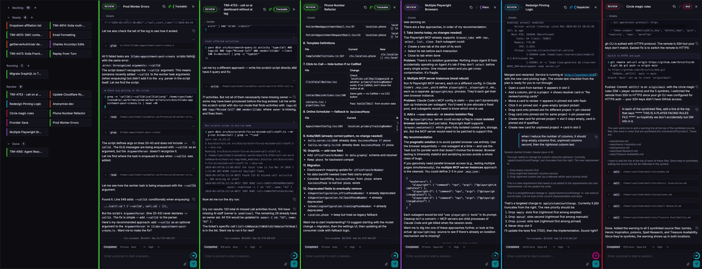

# Orchestrel



Orchestrel is a local-first control room for AI coding work. It combines a project-aware kanban board, a chat-style session view, git worktree automation, and a long-running Claude Agent SDK daemon so multiple coding tasks can run and resume independently.

The core workflow is simple: create a card, attach it to a local project, move it to **Running**, and Orchestrel starts or resumes an agent session in the right working directory. Output streams back live, context usage is tracked, background compaction keeps long sessions usable, and completed sessions move to **Review** automatically.

## Features

**Board and Chat Views**
- Board route with Backlog, Ready, Running, Review, Done, and Archive states.
- Chat route for a focused conversation-first workflow over the same card/session data.
- Multi-column desktop detail panes with manual pinning, project-aware hotseat selection, and mobile overlays.
- Project filters, full-card search, paginated column loading, archive view, and local IndexedDB cache.
- Inline card editing, autosaved prompt drafts, copyable session IDs, and copyable worktree paths.

**Agent Sessions**
- Long-running `orcd` daemon manages Claude Agent SDK sessions over a UNIX socket.
- Server-owned lifecycle: cards entering **Running** create or resume sessions; session exit moves running cards to **Review**.
- Live streaming of assistant text, thinking, tool calls, tool results, errors, status, and context usage.
- Follow-up prompts, Continue, Stop, reconnect, and manual compaction controls.
- File attachments up to 25 MB per file through `/api/upload`.
- Session transcript reload from Claude JSONL history plus live replay from the daemon event buffer.
- Synthetic subagent activity feed from Agent/Task launches and async task notifications.

**Context and Memory**
- Per-card context gauge backed by provider/model context window metadata.
- Configurable summarize threshold per card, including Off and 50-90% presets.
- Two-phase background compaction: summarize while a turn is running, then rewrite JSONL at a safe idle boundary.
- Optional memory upsert at session exit and terminal card transitions, backed by a configured memory API.

**Projects and Worktrees**
- Project registry for local repositories and non-repo working directories.
- Auto-detects git repositories and default branch metadata.
- Optional per-card worktree branch creation, with project setup commands after worktree creation.
- Worktree cleanup when a worktree-backed card is archived.
- Per-project defaults for provider, model, thinking level, worktree usage, branch, color, and memory endpoint overrides.
- Project archiving and Cloudflare Access user/project visibility controls.

**Provider Configuration**
- `config.yaml` drives providers and model aliases.
- Anthropic API, Claude Max OAuth fallback, Claude-compatible proxies, auth-token proxies, and AWS Bedrock providers are supported.
- Model labels and context windows are exposed to the UI and used for context tracking.

**API and Auth**
- Socket.IO is the primary app transport with typed, Zod-validated events.
- REST API is generated with TSOA and served with Swagger UI at `/api/docs`.
- Optional Cloudflare Access JWT auth for remote deployments; local/LAN requests use a local admin identity.

## Tech Stack

| Layer | Technology |
| --- | --- |
| Frontend | React 19, React Router 7 SPA mode, MobX |
| Styling | Tailwind CSS 4, shadcn/ui-style Radix components, lucide-react |
| Realtime | Socket.IO |
| Server | Express 5, TSOA REST routes, Swagger UI |
| Daemon | `orcd` UNIX-socket service |
| Agent runtime | `@anthropic-ai/claude-agent-sdk` |
| Database | SQLite via TypeORM and better-sqlite3 |
| Local cache | IndexedDB via idb-keyval |
| Drag and drop | dnd-kit |
| Build and test | Vite 7, TypeScript 5.9, Vitest, oxlint |

## Architecture

```text
┌────────────────────────────────────────────────────────────┐
│ Browser SPA                                                │
│ React components ←→ MobX stores ←→ Socket.IO client        │
│ Board view, Chat view, SessionView, project settings       │
└──────────────────────────┬─────────────────────────────────┘
                           │ Socket.IO + REST
┌──────────────────────────┴─────────────────────────────────┐
│ Orchestrel web server                                      │
│ Express, generated REST API, uploads, Socket.IO handlers   │
│ TypeORM models, services, message bus, subscriptions       │
│ OrcdClient reconnect/reconcile layer                       │
└──────────────────────────┬─────────────────────────────────┘
                           │ JSON lines over UNIX socket
┌──────────────────────────┴─────────────────────────────────┐
│ orcd daemon                                                │
│ Session registry, event replay buffer, lifecycle hooks     │
│ Claude Agent SDK query streams, compaction, memory upsert  │
└──────────────────────────┬─────────────────────────────────┘
                           │ Claude Code session JSONL
┌──────────────────────────┴─────────────────────────────────┐
│ Local projects and worktrees                               │
│ ~/.claude/projects session history + git worktree dirs     │
└────────────────────────────────────────────────────────────┘
```

Key patterns:

- **Daemon-owned agent runtime**: `orcd` keeps active sessions alive independently of the web server and exposes create, message, subscribe, cancel, compact, list, and memory-upsert actions.
- **Server-owned card lifecycle**: the browser mutates cards; backend listeners start, cancel, reconcile, and route sessions.
- **Event fanout**: TypeORM subscribers publish card/project changes to an internal bus, and Socket.IO subscriptions fan those changes to clients.
- **Session reconciliation**: on web-server startup or `orcd` reconnect, running cards are compared with daemon session state and moved to Review if their session is no longer alive.
- **Config-driven providers**: model aliases and context windows come from `config.yaml`, not hard-coded UI choices.

## Prerequisites

- Node.js 20+
- pnpm
- Claude Code executable available at `/home/ryan/.local/bin/claude`
- Claude authentication through Claude Max OAuth, Anthropic API key, compatible proxy credentials, or AWS Bedrock credentials
- Optional Ollama on `localhost:11434` with `llama3.2:latest` for title suggestions
- Optional memory API for session memory upsert

## Setup

```bash
pnpm install
cp config.example.yaml config.yaml
cp .env.example .env
```

Edit `config.yaml` first. It is required by both `orcd` and the web app.

```yaml
socket: ~/.orc/orcd.sock
defaultProvider: anthropic
defaultModel: sonnet
defaultCwd: ~/Code

providers:
  anthropic:
    label: Anthropic
    models:
      opus:   { label: "Opus 4.7",   modelID: claude-opus-4-7,   contextWindow: 1000000 }
      sonnet: { label: "Sonnet 4.6", modelID: claude-sonnet-4-6, contextWindow: 1000000 }
```

Then run the daemon and web app in separate terminals:

```bash
pnpm orcd
pnpm dev
```

Development mode runs on `http://localhost:6195` by default. Production mode uses `http://localhost:6194`.

## Commands

| Command | Description |
| --- | --- |
| `pnpm dev` | Generate TSOA routes, start the Vite/Express development server |
| `pnpm orcd` | Start the `orcd` session daemon |
| `pnpm build` | Generate TSOA routes and build the React Router app |
| `pnpm start` | Start the production Express server from the built app |
| `pnpm test` | Run Vitest |
| `pnpm typecheck` | Generate React Router types and run TypeScript build checks |
| `pnpm lint` | Run oxlint over `app` and `src` |
| `pnpm tsoa:generate` | Regenerate REST routes and OpenAPI spec |

## Configuration

`config.yaml` is resolved from `ORC_CONFIG` when set, otherwise `./config.yaml`.

The `orc` wrapper also honors `ORC_PROVIDER` and `ORC_MODEL` as CLI defaults when provider/model args are omitted. Positional args still win:

```bash
ORC_PROVIDER=trackable ORC_MODEL=auto orc "summarize this repo"
orc anthropic sonnet "use the normal config instead"
```

| Key | Description |
| --- | --- |
| `socket` | UNIX socket path used by the web server to reach `orcd` |
| `defaultProvider` | Provider ID used by `orcd` when no card/project override applies |
| `defaultModel` | Model alias used by `orcd` when no card/project override applies |
| `defaultCwd` | Default base directory for new work |
| `providers` | Provider map exposed to the UI and used by `orcd` |
| `memoryUpsert` | Optional memory API settings used by `orcd` |

Provider entries can use:

| Field | Description |
| --- | --- |
| `label` | UI label |
| `type` | Omit for Anthropic-compatible HTTP; use `bedrock` for AWS Bedrock |
| `baseUrl` | Anthropic-compatible API base URL |
| `apiKey` | Value passed as `ANTHROPIC_API_KEY` |
| `authToken` | Value passed as `ANTHROPIC_AUTH_TOKEN` |
| `region` / `profile` | AWS Bedrock settings |
| `models` | Alias map with `label`, `modelID`, and `contextWindow` |

`.env` controls the web server:

| Variable | Default | Description |
| --- | --- | --- |
| `PORT` | `6194` production, `6195` development | HTTP server port |
| `HOST` | `0.0.0.0` | Bind address |
| `NODE_ENV` | unset | Set to `development` for Vite middleware/HMR |
| `HMR_HOST` | unset | Optional public HMR host for tunneled development |
| `CF_TEAM_DOMAIN` | unset | Enables Cloudflare Access JWT verification |
| `ADMIN_EMAILS` | unset | Comma-separated Cloudflare Access emails with admin role |

Runtime data is stored in:

- `data/orchestrel.db` for cards, projects, users, and project visibility.
- `~/.orc/orcd.sock` by default for the daemon socket.
- `~/.claude/projects/.../*.jsonl` for Claude session history.
- `/tmp/orchestrel-uploads/<session>` for uploaded prompt files.

## Card Lifecycle

```text
Backlog → Ready → Running → Review → Done → Archive
                     │          ▲
                     │          │
                     └──────────┘
                  session exit
```

1. Create a card on the board or start a session from `/chat`.
2. Select a project, provider/model, optional worktree branch, source branch, and summarize threshold.
3. Move the card to **Running** or create it directly as running.
4. Backend listeners create the worktree if needed, run setup commands, and ask `orcd` to create or resume the session.
5. Streamed SDK events update the transcript, counters, context gauge, subagent feed, and status.
6. On session exit, running cards move to **Review**.
7. Follow up from Review or Running, stop active sessions, compact long sessions manually, or move cards to Done/Archive.
8. Archiving a worktree-backed card removes its worktree.

## Project Structure

```text
server.js                         Express entry point, Vite middleware, prod static server
config.example.yaml               Provider, model, socket, and memory config template
app/
  routes/                         Board and chat React Router routes
  components/                     CardDetail, SessionView, transcript, settings, UI primitives
  stores/                         MobX stores for root, cards, projects, sessions, config
  lib/                            Socket.IO client, persistence, slot resolution, utilities
src/
  orcd/                           UNIX-socket daemon, session registry, Claude SDK runtime
  lib/                            Compaction, summarization, memory upsert, session repair
  server/
    api/                          TSOA controllers and generated OpenAPI routes
    controllers/                  Card/session orchestration
    models/                       TypeORM entities and lightweight migrations
    services/                     Card, project, user, and worktree services
    ws/                           Socket.IO auth, handlers, subscriptions
  shared/                         Config parsing, protocol types, worktree helpers, constants
docs/                             Historical designs and implementation plans
```

## REST API

The app is Socket.IO-first, but it also exposes generated REST endpoints for cards and projects. After starting the web server:

- Swagger UI: `http://localhost:6194/api/docs`
- OpenAPI JSON: `http://localhost:6194/api/docs/swagger.json`

Use the development port `6195` when running `pnpm dev`.

## Deployment Notes

For production, build the app, run `orcd`, then start the web server:

```bash
pnpm build
pnpm orcd
pnpm start
```

If exposing Orchestrel remotely, set `CF_TEAM_DOMAIN` and put it behind Cloudflare Access. Localhost and LAN hosts bypass Access and receive the local admin identity; remote clients require a valid `CF_Authorization` cookie. Set `ADMIN_EMAILS` to grant project/user administration to specific Access users.

## License

MIT
