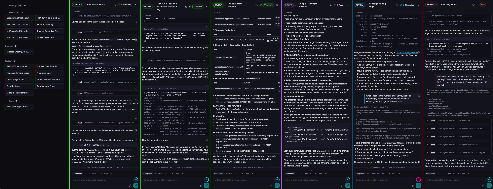

# Orchestrel



Orchestrel is a local-first control room for AI coding work. It combines a project-aware kanban board, a chat-style session view, git worktree automation, and a fleet of long-running `orcd` daemons built on the Pi TypeScript SDK, so multiple coding tasks can run and resume independently — on one box or across several.

The core workflow: create a card, attach it to a project, move it to **Running**, and Orchestrel starts or resumes an agent session in the right working directory on the right node. Output streams back live, context usage is tracked, background compaction keeps long sessions usable, and completed sessions move to **Review** automatically.

## Architecture

Five layers, from browser to model provider:

| # | Layer | Description | Location |
|---|-------|-------------|----------|
| 1 | **Orc UI** | React frontend, runs in browser | `app/` |
| 2 | **Orc Backend** | Web server: Socket.IO, REST, controllers, event bus | `src/server/` |
| 3 | **orcd** | Standalone daemon, one per node, manages Pi agent sessions | `src/orcd/` |
| 4 | **Agent sessions** | Pi SDK sessions with native tools, extensions, MCP | managed by Pi |
| 5 | **Providers / proxies** | Anthropic, Bedrock, local proxies, OAuth extensions | per-node config |

```text
┌────────────────────────────────────────────────────────────┐
│ Browser SPA                                                │
│ React components ←→ MobX stores ←→ Socket.IO client        │
│ Board view, Chat view, SessionView, project settings       │
└──────────────────────────┬─────────────────────────────────┘
                           │ Socket.IO + REST
┌──────────────────────────┴─────────────────────────────────┐
│ Orchestrel web server (BE)                                 │
│ Express, generated REST API, uploads, Socket.IO handlers   │
│ TypeORM models, services, message bus, subscriptions       │
│ OrcdClient per node — reconnect/reconcile layer            │
└───────────┬──────────────────────────────┬─────────────────┘
            │ authenticated TCP (orc.yaml) │
┌───────────┴────────────┐    ┌────────────┴────────────────┐
│ orcd — node "local"    │    │ orcd — node "max" (remote)  │
│ Session registry,      │    │ Same daemon on another box, │
│ event ring buffer,     │    │ runs agents next to that    │
│ Pi SDK sessions,       │    │ box's project checkouts     │
│ worktrees, compaction  │    │                             │
└───────────┬────────────┘    └────────────┬────────────────┘
            │ Pi runtime/session APIs      │
┌───────────┴────────────┐    ┌────────────┴────────────────┐
│ Local projects,        │    │ Remote projects, worktrees, │
│ worktrees, ~/.pi       │    │ that box's ~/.pi resources  │
└────────────────────────┘    └─────────────────────────────┘
```

### Multi-node

Orchestrel supports multiple orcd nodes (remote execution boxes). The BE connects to each node over authenticated TCP and routes card sessions to the node named by the project's `node_name`. Cards inherit the project's node. Agents run on the node holding the project files — native edit tools work locally — while orchestration stays central.

- **`orc.yaml`** (gitignored; see `orc.example.yaml`) — node registry on the BE: `name`, `host`, `port`, `authToken` per node.
- **`orcd.yaml`** (gitignored; see `orcd.example.yaml`) — per-box daemon config: `listen`, `authToken`, `name`, `providers`, `defaultProvider`, `defaultModel`, `defaultCwd`, `ringBufferSize`.
- **`config.yaml`** — symlink to `orcd.yaml` (backward compat for `src/shared/config.ts`).

### Session lifecycle ownership

orcd owns session lifecycle. The BE never infers session state from SDK events like `result` — a `result` means one agent turn completed, not that the session is done (background tasks and subagents may still be running). orcd emits `session_exit` when the session actually closes; the BE reacts to that to move cards to Review. Each node keeps a per-session event ring buffer so the BE can replay missed events after an outage.

### Event-driven design

The backend is purely event-driven: every handler reacts to a single event plus current observable state, in isolation. No handler assumes a prior step occurred or encodes a workflow sequence — behavior emerges from independent, composable listeners, and the system tolerates events arriving out of order or replayed.

### Provider routing

Provider config lives in each node's `orcd.yaml`. orcd registers every provider generically — no provider-specific branches. Provider-specific behavior lives outside orcd in Pi extensions: e.g. Claude Max OAuth and its request reshaping ship as the `claude-max` extension in the pi-agent config repo (github.com/rbrcurtis/pi-agent), which Pi auto-discovers from `~/.pi/agent/extensions/`. Setting `oauth: claude-max` on a provider requires that extension to be installed on that node.

## Features

**Board and Chat Views**
- Board route with Backlog, Ready, Running, Review, Done, and Archive states.
- Chat route for a focused conversation-first workflow over the same card/session data.
- Multi-column desktop detail panes with manual pinning, project-aware hotseat selection, and mobile overlays.
- Project filters, full-card search, paginated column loading, archive view, and local IndexedDB cache.
- Inline card editing, autosaved prompt drafts, copyable session IDs, and copyable worktree paths.

**Agent Sessions**
- `orcd` daemons embed the Pi TypeScript SDK and manage sessions over authenticated TCP.
- `bin/orc` wraps the `pi` CLI, applying Orchestrel provider/model defaults before handing off to Pi.
- Server-owned lifecycle: cards entering **Running** create or resume sessions; `session_exit` moves running cards to **Review**.
- Live streaming of assistant text, thinking, tool calls, tool results, errors, status, and context usage.
- Follow-up prompts, Continue, Stop, reconnect, and manual compaction controls.
- File attachments up to 25 MB per file through `/api/upload`.
- Session transcript reload from Pi session history (including remote nodes via `get_history`) plus live replay from the daemon event buffer.
- Synthetic subagent activity feed from Agent/Task launches and async task notifications.

**Context and Memory**
- Per-card context gauge backed by provider/model context window metadata.
- Configurable summarize threshold per card, including Off and 50–90% presets.
- Background compaction is Pi-native and applies through the active Pi session at safe lifecycle boundaries.
- Optional memory upsert at session exit and terminal card transitions, backed by a configured memory API.

**Projects and Worktrees**
- Project registry binding each project to a path and an orcd node.
- Auto-detects git repositories and default branch metadata.
- Optional per-card worktree branch creation, with project setup commands after worktree creation.
- Worktree cleanup when a worktree-backed card is archived.
- Per-project defaults for provider, model, thinking level, worktree usage, branch, color, and sandbox.
- Project archiving and Cloudflare Access user/project visibility controls.

**API and Auth**
- Socket.IO is the primary app transport with typed, Zod-validated events.
- REST API is generated with TSOA and served with Swagger UI at `/api/docs`.
- Optional Cloudflare Access JWT auth for remote deployments; local/LAN requests use a local admin identity.

## Tech Stack

| Layer | Technology |
| --- | --- |
| Frontend | React 19, React Router 7 SPA mode, MobX |
| Styling | Tailwind CSS 4, shadcn/ui-style Radix components, lucide-react |
| Realtime | Socket.IO |
| Server | Express 5, TSOA REST routes, Swagger UI |
| Daemon | `orcd` TCP service (token-authenticated, one per node) |
| Agent runtime | Pi TypeScript SDK (`@earendil-works/pi-coding-agent`, `@earendil-works/pi-ai`) |
| CLI wrapper | `bin/orc` wrapping the `pi` CLI |
| Database | SQLite via TypeORM and better-sqlite3 |
| Local cache | IndexedDB via idb-keyval |
| Drag and drop | dnd-kit |
| Build and test | Vite 7, TypeScript 5.9, Vitest, oxlint, bun |

## Prerequisites

- Node.js 22+ and bun
- Pi CLI on the PATH (for `bin/orc`)
- Pi user config/auth/model resources under `~/.pi` on every node that runs agents
- Optional Ollama on `localhost:11434` with `llama3.2:latest` for title suggestions
- Optional memory API for session memory upsert

## Setup

```bash
bun install
cp orcd.example.yaml orcd.yaml    # per-box daemon config
ln -sf orcd.yaml config.yaml      # legacy path some modules still read
cp orc.example.yaml orc.yaml      # node registry for the BE
cp .env.example .env
```

Edit `orcd.yaml` (providers, listen address, auth token, node name) and `orc.yaml` (one entry per node; a single `local` entry pointing at `127.0.0.1:7420` is the minimal setup). Then run the daemon and web app in separate terminals:

```bash
bun run orcd
bun run dev
```

Development mode runs on `http://localhost:6195` by default. Production mode uses `http://localhost:6194`.

## Commands

| Command | Description |
| --- | --- |
| `bun run dev` | Generate TSOA routes, start the Vite/Express development server |
| `bun run orcd` | Start the `orcd` session daemon |
| `bun run build` | Generate TSOA routes and build the React Router app |
| `bun run start` | Start the production Express server from the built app |
| `bun run test` | Run Vitest |
| `bun run typecheck` | Generate React Router types and run TypeScript build checks |
| `bun run lint` | Run oxlint over `app` and `src` |
| `bun run tsoa:generate` | Regenerate REST routes and OpenAPI spec |

## Configuration

### `orc.yaml` — node registry (BE only)

```yaml
servers:
  - name: local
    host: 127.0.0.1
    port: 7420
    authToken: <token>
  - name: max
    host: max.local
    port: 7420
    authToken: <token>
```

Each project in the UI selects one of these node names; its cards run there.

### `orcd.yaml` — per-node daemon config

Resolved from `ORC_CONFIG` when set, otherwise `./config.yaml` (the symlink).

| Key | Description |
| --- | --- |
| `listen` | `host`/`port` the daemon binds (default port 7420) |
| `authToken` | Shared secret the BE must present; must match the node's `orc.yaml` entry |
| `name` | Node name, must match the `orc.yaml` entry |
| `defaultProvider` / `defaultModel` | Used when no card/project override applies |
| `defaultCwd` | Default base directory for new work |
| `ringBufferSize` | Per-session event buffer; size to cover the max expected BE↔node outage |
| `providers` | Provider map exposed to the UI and used for Pi model routing |
| `memoryUpsert` | Optional memory API settings used by orcd at session end |

Provider entries:

| Field | Description |
| --- | --- |
| `label` | UI label |
| `type` | Omit for Anthropic-format routing; `bedrock` for AWS Bedrock |
| `baseUrl` | Optional provider/proxy API base URL |
| `apiKey` / `authToken` | Credentials; `${VAR}` values resolve against the daemon's environment |
| `oauth` | Names a Pi extension that provides OAuth (e.g. `claude-max`); requires that extension installed on the node |
| `region` / `profile` | AWS Bedrock settings |
| `aliases` | Maps `primary`/`subagent`/`lightweight` roles to model keys for SDK subagent spawning |
| `models` | Alias map with `label`, `modelID`, and `contextWindow` |

Pi runtime resources are intentionally separate from Orchestrel config: auth, model registry, prompt templates/commands, skills, and session storage live in Pi's canonical user config directory (`~/.pi`, agent data under `~/.pi/agent`). Project instructions are resolved by Pi from files such as `AGENTS.md` in the project tree.

### `.env` — web server

| Variable | Default | Description |
| --- | --- | --- |
| `PORT` | `6194` production, `6195` development | HTTP server port |
| `HOST` | `0.0.0.0` | Bind address |
| `NODE_ENV` | unset | Set to `development` for Vite middleware/HMR |
| `HMR_HOST` | unset | Optional public HMR host for tunneled development |
| `CF_TEAM_DOMAIN` | unset | Enables Cloudflare Access JWT verification |
| `ADMIN_EMAILS` | unset | Comma-separated Cloudflare Access emails with admin role |

Runtime data:

- `data/orchestrel.db` — cards, projects, users, project visibility.
- `~/.pi` — Pi auth, model registry, extensions, session history (per node).
- `/tmp/orchestrel-uploads/<session>` — uploaded prompt files.

## Remote Node Setup

Adding an execution box (checklist — every step is required; the Pi extension step is the one most easily missed):

1. **Checkout + deps**: clone Orchestrel on the node (e.g. `~/Code/orchestrel`), `bun install`. Node.js and npm must be present.
2. **`orcd.yaml`**: set `listen`, a unique `name`, an `authToken`, and the node's providers. Symlink `config.yaml → orcd.yaml`.
3. **Service**: run `bun run orcd` under launchd (macOS, e.g. `com.orchestrel.orcd` LaunchAgent) or systemd (Linux), enabled at boot.
4. **Register on the BE**: add the node to `orc.yaml` with matching name/host/port/token. Point projects at it via their `node_name`.
5. **Pi runtime dir** (`~/.pi/agent` on the node): `auth.json`, `mcp.json`, `AGENTS.md` (symlink to your global instructions), `skills` symlink.
6. **Pi extensions** — not deployed by anything automatic, and without them agent capabilities silently degrade:
   - **`pi-mcp-adapter`** — required for MCP. Without it, no MCP servers connect for any session on the node, even when `mcp.json` / project `.mcp.json` exist. Install via npm so its dependencies resolve:

     ```bash
     mkdir -p ~/.pi/ext-packages && cd ~/.pi/ext-packages
     npm install pi-mcp-adapter
     ln -sfn ~/.pi/ext-packages/node_modules/pi-mcp-adapter ~/.pi/agent/extensions/pi-mcp-adapter
     ```

   - **`shared-memory-reinforce.ts`** — copy from an existing node's `~/.pi/agent/extensions/`; injects the shared-memory usage reminder at new-session start (Pi does not run Claude Code hooks).
   - **`claude-max`** — only if a provider on the node sets `oauth: claude-max`; ships with the pi-agent config repo (`~/.pi/agent/extensions/claude-max`, deps installed by its `setup.sh`).
7. **Project checkouts**: the node needs the actual project files at the paths registered in the UI.

Extensions load per session (at `createAgentSession`), so installing them does not require an orcd restart — but already-running sessions won't gain tools until they exit and are resumed.

## MCP in Agent Sessions

orcd contains no MCP code. The `pi-mcp-adapter` extension connects servers at `session_start`, merging configs in increasing precedence (same-named servers override):

1. `~/.config/mcp/mcp.json` (generic global)
2. `~/.pi/agent/mcp.json` (Pi global)
3. `<cwd>/.mcp.json` (project — shared with Claude Code)
4. `<cwd>/.pi/mcp.json` (project Pi override)

Per-project MCP therefore works by committing a `.mcp.json` to the repo; it overrides the global entry of the same name.

**Worktree caveat**: worktree-backed cards run with `cwd` set to the worktree, and new worktree branches are created from `origin/<source_branch>`. A project `.mcp.json` only reaches those sessions if it is committed **and pushed** to origin on the source branch.

## Card Lifecycle

```text
Backlog → Ready → Running → Review → Done → Archive
                     │          ▲
                     │          │
                     └──────────┘
                  session exit
```

1. Create a card on the board or start a session from `/chat`.
2. Select a project, provider/model, optional worktree branch, source branch, and summarize threshold.
3. Move the card to **Running** or create it directly as running.
4. Backend listeners route the request to the project's node; orcd creates the worktree if needed, runs setup commands, and creates or resumes the Pi session.
5. Streamed Pi SDK events update the transcript, counters, context gauge, subagent feed, and status.
6. On `session_exit`, running cards move to **Review**.
7. Follow up from Review or Running, stop active sessions, compact long sessions manually, or move cards to Done/Archive.
8. Archiving a worktree-backed card removes its worktree.

## Project Structure

```text
server.js                         Express entry point, Vite middleware, prod static server
orc.example.yaml                  Node registry template (BE)
orcd.example.yaml                 Per-node daemon config template
bin/
  orc                             Wrapper around the pi CLI with Orchestrel provider/model routing
scripts/                          DB backup, migrations
app/
  routes/                         Board and chat React Router routes
  components/                     CardDetail, SessionView, transcript, settings, UI primitives
  stores/                         MobX stores for root, cards, projects, sessions, config
  lib/                            Socket.IO client, persistence, slot resolution, utilities
src/
  orcd/                           TCP daemon, session registry, worktree ops, Pi SDK runtime
  lib/                            Pi history, compaction, summarization, memory upsert
  server/
    api/                          TSOA controllers and generated OpenAPI routes
    controllers/                  Card/session orchestration
    models/                       TypeORM entities and lightweight migrations
    services/                     Card, project, user, and worktree services
    ws/                           Socket.IO auth, handlers, subscriptions
  shared/                         Config parsing, protocol types, worktree helpers, constants
docs/                             Historical designs and implementation plans
```

## REST API

The app is Socket.IO-first, but it also exposes generated REST endpoints for cards and projects. After starting the web server:

- Swagger UI: `http://localhost:6194/api/docs`
- OpenAPI JSON: `http://localhost:6194/api/docs/swagger.json`

Use the development port `6195` when running `bun run dev`.

## Deployment Notes

For production, build the app, run `orcd`, then start the web server:

```bash
bun run build
bun run orcd
bun run start
```

If exposing Orchestrel remotely, set `CF_TEAM_DOMAIN` and put it behind Cloudflare Access. Localhost and LAN hosts bypass Access and receive the local admin identity; remote clients require a valid `CF_Authorization` cookie. Set `ADMIN_EMAILS` to grant project/user administration to specific Access users.

## License

MIT
